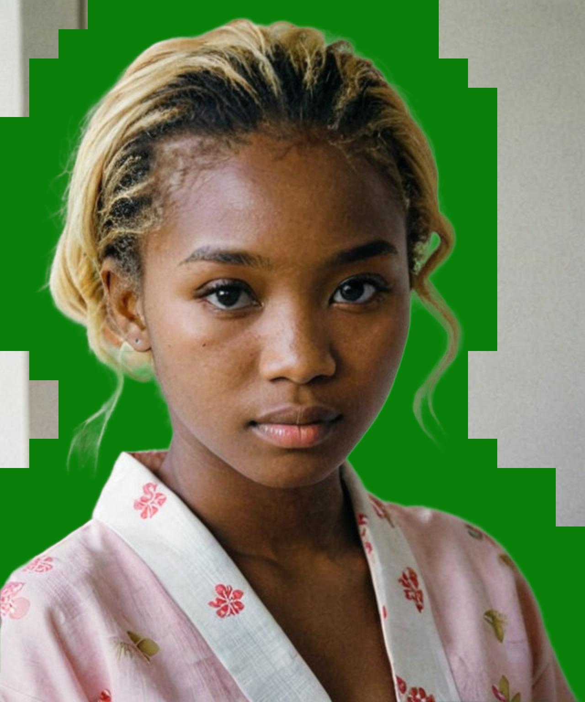

# RESUNET: Trimap Refinement for Alpha Matting

## Project Description

RESUNET is a project aimed at improving the alpha matting process, specifically focusing on refining the trimap of an image. Alpha matting is a crucial technique in image processing, allowing for the precise extraction of objects from a scene.

The trimap is a fundamental step in alpha matting, where pixels in the image are classified as "foreground," "background," or "unknown." RESUNET utilizes an advanced neural network architecture to enhance this pixel classification, improving the quality of the resulting trimap and, consequently, the accuracy of alpha matting.

## Key Features

1. **Trimap Refinement:** RESUNET uses a trained neural network to refine the pixel classification in the trimap, providing a more accurate segmentation between objects and the background.

2. **Improved Alpha Matting Quality:** With the enhanced trimap, the alpha matting process becomes more effective, resulting in more precise and detailed alpha masks.

3. **Custom Training:** Users have the option to train the RESUNET model with custom datasets, adapting the neural network for specific scenarios.

## Installation Requirements

1. **Python:** Version 3.9 or above.
2. **Python Libraries:**  Tensorflow, Pillow, tqdm and numpy.
3. **GPU (optional):** Recommended for accelerating the training process.

## How to Use

1. **Model Training:**
   ```bash
   python train_tf.py
    ```

2. **Inference :**
    ```bash
    python inference.py  image_rgb.png  image_trimap.png  output.png
     ```


## Pre Trained Model
  in the folder pre_trained_model we have the pre trained model for the RESUNET, you can use it for inference.
  This pre trained model is trained on the P3M dataset , with 3 epochs. patchs of 256x256, and batch size of 16 images.


Examples of images:

 
 
 

 
 
 
